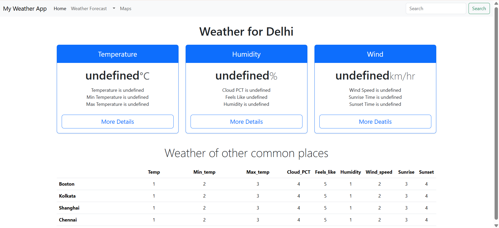

# 🌦️ Weather App

A responsive weather web application that provides real-time weather updates for any city using API integration. The app displays essential weather parameters such as temperature, humidity, wind speed, and sunrise/sunset details through a simple and user-friendly interface.

---

## 🚀 Features

- ✅ Search weather by city name  
- ✅ Real-time temperature and weather conditions  
- ✅ Humidity and wind speed details  
- ✅ Sunrise and sunset timing  
- ✅ Responsive and clean UI  
- ✅ Dynamic data rendering using JavaScript  

---

## 🛠️ Tech Stack

- **HTML** – Structure and layout  
- **CSS** – Styling and responsiveness  
- **JavaScript** – API integration and dynamic updates  
- **Weather API** – Fetching real-time weather data  

---

## 📸 Project Preview



---

## ⚡ How to Run Locally

1. Clone the repository  
   ```bash
   git clone https://github.com/your-username/Weather-App.git
2. Open index.html in your browser

3. Enter a city name and view live weather data

---

## 💡 Learning Outcomes

-  Working with APIs and handling JSON data

-  DOM manipulation and dynamic UI updates

-  Responsive layout design

-  Debugging and error handling

---

## 🔮 Future Improvements

-  Weather icons and animations

-  Location-based weather detection

-  5-day forecast feature

-  Loading indicator for better UX
 
